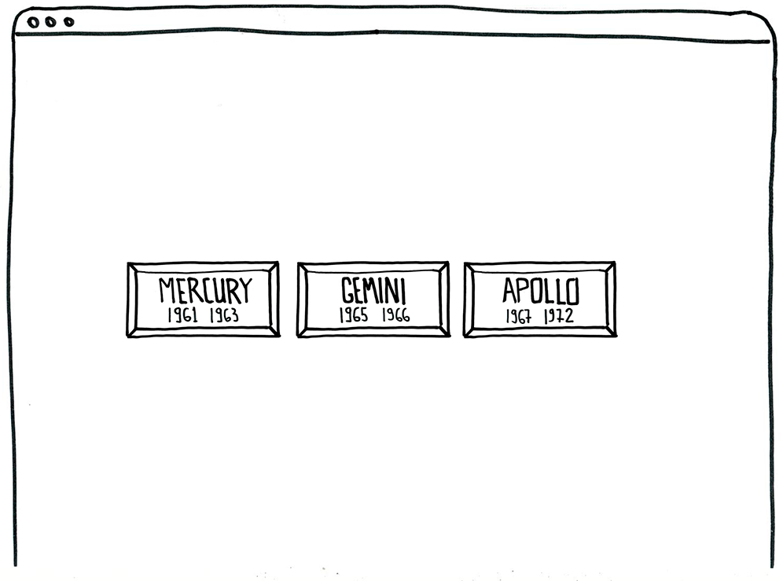
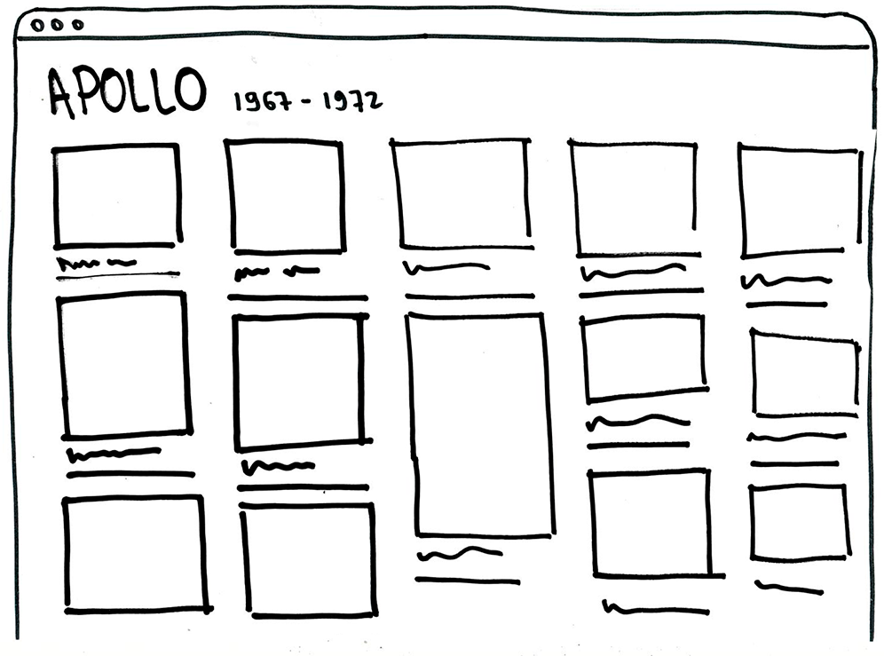

# Nasa Projects
> Teste para vaga de estágio para desenvolvimento frontend na São Paulo Urbanismo.

Olá! Muito obrigado pelo seu interesse em trabalhar conosco. 

Este teste tem como objetivo avaliar as suas habilidades de trabalhar colaborativamente com git/github e, principalmente, avaliar seus conhecimentos nos fundamentos das tecnologias de desenvolvimento frontend: **html**, **css** e **javascript**. 

Boa sorte!

## Desafio NASA
O seu desafio será trabalhar com a API de mídias da NASA. A agência aeroespacial dos EUA.

 __Se nunca trabalhou com uma API antes não se preocupe__. No arquivo [main.js](main.js) já fizemos a requisição para você. (veja o método `getNasa`)

Você deverá criar uma aplicação com dois estados. Uma antes de clicar e outra após clicar.

## Estado 1 - pré-click: três botões
Deverá ter botões com o nome e data de vigência de cada projeto



## Estado 2 - pós-click: lista imagens
Após clicar em um dos três botões devemos ver uma lista de imagens e títulos:



E pronto. É isso!

## O que devo saber para completar este desafio?
Será necessário saber um pouco sobre os seguintes tópicos:
 - html
 - css
 - manipular a [DOM](https://developer.mozilla.org/pt-BR/docs/DOM/Referencia_do_DOM) com javascript
 - git

## Regras
O objetivo deste desafio é avaliar apenas os **fundamentos** (html, css e js). Portanto para fazermos uma avaliação justa, será necessário que você siga algumas regras:
 - **Não crie nenhum arquivo neste repositório** apenas altere os arquivos __index.html__, __main.js__ e __style.css__.
 - **Não utilize cdns, npm ou cópias locais de libs externas**. Queremos ver o seu código apenas com vanilla js e css.
 - É implícito da regra anterior mas enfatizando: __não utilize bootstrap css nem jQuery__.
 - **Não se preocupe com IE**. A avaliação será feita na última versão do [firefox dev edition](https://www.mozilla.org/en-US/firefox/developer/). Portanto você pode e deve usar boa parte da nova api do ecmascript (e utilizar __let__ e __const__, por exemplo).


## Por onde começo?
> Se você não preencheu, preencha o [form do google docs](https://docs.google.com/forms/d/e/1FAIpQLSflg-61RuyZ2K-rpZCBXzrFaOgIcKgCRMUmrEq7FjBiEf_0Pw/viewform?usp=sf_link). Isto é importante para a sua identificação.

Você deve fazer um fork desse repositório para sua conta do Github.

Após terminar o desafio no seu fork, você pode solicitar uma pull request para a branch master do nosso repositório. Faremos a avaliação apenas das pull requests recebidas.

## Dicas
* A lista pode ser incluída na lista de id `result` no [index.html](index.html)
```html
<ul id="result">
    <!-- Monte aqui a sua lista de imagens da NASA -->
</ul>
```

... por um método definido no [main.js](main.js)
```javascript
function setNasa (nasaItems, listId) {
  /*
    * Manipule o DOM para montar a sua lista de imagens
  */
}
```

 * Como **não será aceito nenhum framework css** para estruturar o seu layout aconselhamos que utilize css [grid](https://developer.mozilla.org/pt-BR/docs/Web/CSS/CSS_Grid_Layout/Basic_Concepts_of_Grid_Layout) e [flexbox](https://developer.mozilla.org/pt-BR/docs/Learn/CSS/CSS_layout/Flexbox). 
 > Conhece o trabalho da [Jen Simmons](https://labs.jensimmons.com/)? Ela é uma ótima referência neste assunto!


## Obrigado!
Se chegou até aqui é porque você está realmente interessado. Se tiver dúvidas em relação ao processo envie um email para <a href="mailto:treinamento@spurbanismo.sp.gov.br?subject=vaga%20est&aacute;gio%20frontend">treinamento@spurbanismo.sp.gov.br</a>.

